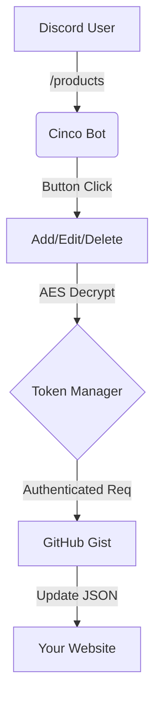

<p align="center">
  <a href="https://github.com/Microck/cinco">
    
  </a>
</p>

<p align="center">a multi-server discord bot that manages shop websites using github gist as a backend. supports real-time sync, schema auto-detection, and encrypted token storage.</p>

<p align="center">
  <a href="LICENSE"></a>
  <a href="https://www.typescriptlang.org/"></a>
  <a href="https://discord.js.org/"></a>
</p>

---

### quickstart

**docker (recommended)**

```bash
git clone https://github.com/microck/cinco.git
cd cinco
cp .env.example .env

# edit .env with your DISCORD_TOKEN, DISCORD_CLIENT_ID, ENCRYPTION_KEY
# generate key: node -e "console.log(require('crypto').randomBytes(32).toString('hex'))"

npm install && npm run register  # register commands once
docker compose up -d
```

**manual**

```bash
npm install
npm run register
npm run dev
```

---

### features

cinco turns discord into a cms for your static site.

- **gist backend:** uses github gists as a database. free, versioned, and fast.
- **interactive menus:** button-based ui for all operations. no commands to memorize.
- **image upload:** drag & drop images, auto-uploaded to catbox.moe.
- **encrypted storage:** all user tokens are aes-256-gcm encrypted at rest.
- **role-based access:** granular permissions (owner, admin, allowed) per server.
- **ai assistant:** built-in help via `/ask` using nvidia llama 4 (if configured).

---

### how it works



1. **connect:** owner runs `/setup token` and `/setup gist <id>` to link a gist.
2. **manage:** use `/products` or `/upcoming` - everything is button-driven.
3. **sync:** bot pushes changes to github immediately.
4. **serve:** your site fetches the raw gist content.

---

### usage

#### 1. setup (owner only)

```
/setup token        → opens modal for github token
/setup gist <id>    → set gist id
/setup baseurl <url> → set your website url (for product links)
/setup view         → view current config
```

#### 2. manage inventory

```
/products           → shows [Add] [List] [Sync] buttons
                      click List → select product → [Edit] [Delete] [Announce]

/upcoming           → shows [Add] [List] buttons
                      same flow for upcoming releases
```


**adding a product:**
1. click [Add] → fill modal (name, price, brand)
2. "add image?" prompt → [Upload Image] or [Skip]
3. if upload: send image in chat → auto-uploaded to catbox
4. done! product saved with [Announce] button


<p align="center">
  
</p>

#### 3. permissions

```
/config add admin @user    → give admin access
/config add allowed @role  → give allowed access
/config list               → view permissions
/config remove @user       → remove access
```

<div align="center">
  
</div>


---

### commands

| command | description |
|:---|:---|
| `/products` | manage products via interactive buttons |
| `/upcoming` | manage upcoming releases via interactive buttons |
| `/setup` | configure gist token, id, and base url (owner only) |
| `/config` | manage user/role permissions |
| `/help` | show available commands |
| `/ask` | ai-powered help (requires nvidia api key) |

---

### project structure

```
cinco/
├── src/
│   ├── commands/    # slash command handlers
│   ├── handlers/    # button, modal, select menu handlers
│   ├── services/    # gist, crypto, catbox upload
│   ├── schema/      # json auto-detection
│   ├── database/    # sqlite + models
│   └── ui/          # embeds & menus
├── data/            # sqlite database
└── dist/            # compiled js
```

---

### troubleshooting

**bot not responding to buttons**
make sure you rebuilt after update: `docker compose up -d --build`

**commands not showing**
run `npm run register` to register slash commands with discord.

**image upload failed**
catbox.moe may be temporarily down. try again or skip image.

**encryption errors**
if you change `ENCRYPTION_KEY` in .env, all stored tokens become unreadable.

**rate limits**
github api: 5000 req/hour. cinco caches reads but writes are direct.

---

### license

mit
