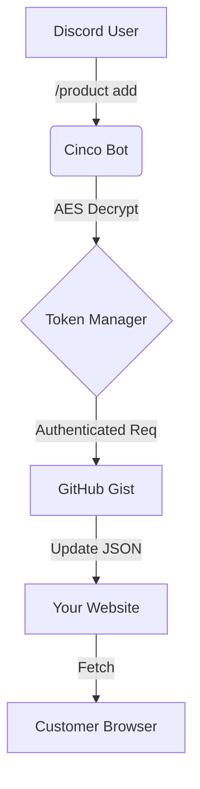

# cinco

[](LICENSE) [](https://www.typescriptlang.org/) [](https://discord.js.org/)

a multi-server discord bot that manages shop websites using github gist as a backend. supports real-time sync, schema auto-detection, and encrypted token storage.

---

### quickstart

[](#quickstart)

**docker (recommended)**

```bash
# clone and setup
git clone https://github.com/microck/cinco.git
cd cinco
cp .env.example .env

# edit .env with your DISCORD_TOKEN
# generate key: node -e "console.log(require('crypto').randomBytes(32).toString('hex'))"

# run
docker compose up -d
```

**manual**

```bash
npm install
npm run register  # register slash commands
npm run dev
```

---

### features

[](#features)

cinco turns discord into a cms for your static site.

-   **gist backend:** uses github gists as a database. free, versioned, and fast.
-   **schema agnostic:** auto-detects if you are selling products, drops, or link lists. maintains your json structure.
-   **encrypted storage:** all user tokens are aes-256-gcm encrypted at rest.
-   **role-based access:** granular permissions (owner, admin, allowed) per server.
-   **ai assistant:** built-in help via `/ask` using nvidia llama 4 (if configured).
-   **health monitoring:** built-in express api for uptime checks.

---

### how it works

[](#how-it-works)

cinco bridges discord interaction directly to your frontend's data source.



1.  **connect:** admin runs `/setup token` to link a gist.
2.  **manage:** use `/product` or `/drop` commands to modify data.
3.  **sync:** bot pushes changes to github immediately.
4.  **serve:** your site fetches the raw gist content.

---

### usage

[](#usage)

#### 1. setup

connect your server to a gist.

> `/setup token <your-github-token>`
> `/setup gist <gist-id>`

#### 2. manage inventory

add a new drop or product.

> `/drop add` -> opens a modal form
> `/product list` -> shows current inventory

#### 3. configuration

manage who can control the bot.

> `/config add admin @user`

---

### commands

[](#commands)

| command | description |
|:---|:---|
| `/quickstart` | **owner only.** interactive wizard to set up everything. |
| `/setup` | configure gist tokens and ids. |
| `/product` | `add`, `list`, `view`, `delete` products. |
| `/drop` | `add`, `list`, `view`, `delete` drops. |
| `/announce` | post a nice embed of a product/drop to a channel. |
| `/sync` | force a pull/push sync with github. |
| `/ask` | ask the ai assistant for help. |
| `/guide` | read the administrator guide. |

---

### project structure

[](#project-structure)

```
cinco/
├── src/
│   ├── commands/    # slash command logic
│   ├── services/    # gist & crypto handlers
│   ├── schema/      # json auto-detection
│   └── ui/          # modals & embeds
├── data/            # sqlite database
└── dist/            # compiled js
```

---

### troubleshooting

[](#troubleshooting)

**json schema mismatch**
if your website uses a different json structure, the bot tries to adapt. ensure your gist has root keys for `products` or `drops`.

**encryption errors**
if you change the `ENCRYPTION_KEY` in .env, all stored tokens will become unreadable. do not lose this key.

**rate limits**
github api has a 5000 req/hour limit. cinco caches reads but writes are direct.

---

### license

[](#license)

mit
